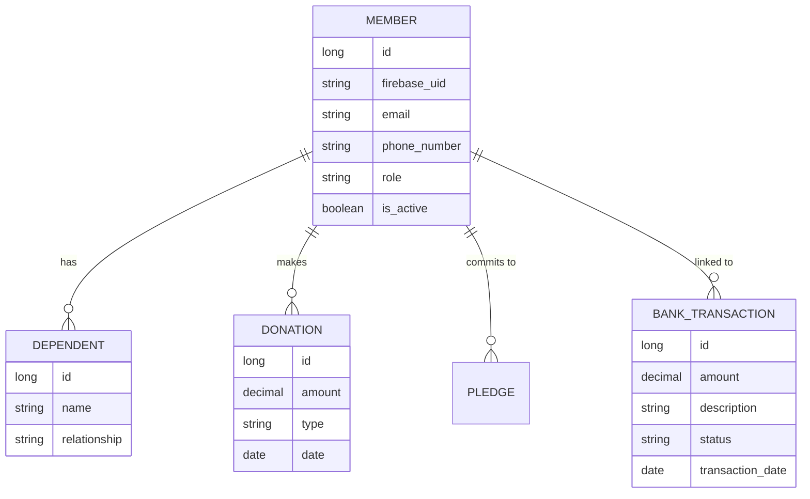
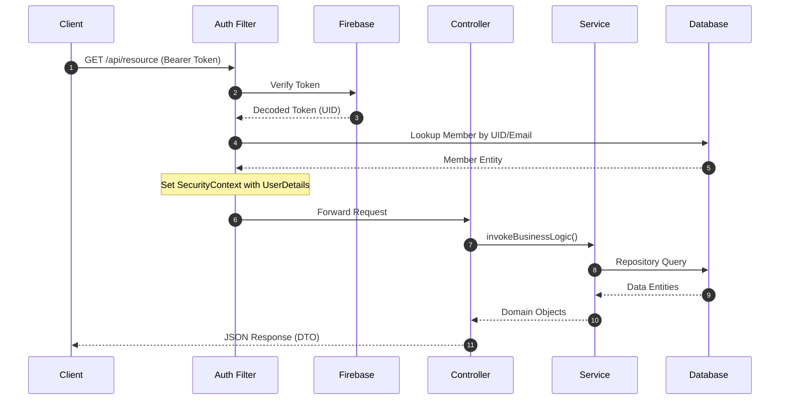

# Java Backend Architecture

## Executive Summary
The `abune-aregawi-backend-java` is a robust, enterprise-grade backend service built with Java 25 and Spring Boot 3.4. It is designed to serve as a high-performance, strictly typed alternative to the existing Node.js backend, providing parity in features while leveraging the Java ecosystem's strengths in maintainability, security, and transaction management.

The system powers the Abune Aregawi Church management platform, handling core domains such as Membership, Finance (Donations, Pledges, Expenses), Communications (SMS, Voicemail), and Event Management.

## System Context

```mermaid
flowchart TB
    Client[Frontend / Mobile App]
    
    subgraph "Backend System"
        API[Spring Boot Backend]
        DB[(PostgreSQL)]
    end
    
    subgraph "External Services"
        Firebase[Firebase Auth & Admin]
        Stripe[Stripe Payments]
        Twilio[Twilio SMS]
        Google[Google APIs\n(YouTube, Drive, Gmail)]
    end

    Client -->|HTTPS / JSON| API
    API -->|JDBC| DB
    API -->|Verify Token| Firebase
    API -->|Process Payment| Stripe
    API -->|Send SMS| Twilio
    API -->|Sync Content| Google
```

## Tech Stack
### Core Frameworks
*   **Language:** Java 25 (Preview features enabled)
*   **Framework:** Spring Boot 3.4.1
*   **Build Tool:** Gradle (Groovy DSL)

### Data & Storage
*   **Database:** PostgreSQL 16+
*   **ORM:** Spring Data JPA (Hibernate)
*   **Migrations:** (Implied via `ddl-auto: update` for dev, recommended Flyway/Liquibase for prod)

### Security & Auth
*   **Authentication:** Firebase Authentication (Custom `FirebaseAuthenticationFilter`)
*   **Security:** Spring Security 6

### External Integrations
*   **Payments:** Stripe (`com.stripe:stripe-java`)
*   **Communications:** Twilio (`com.twilio.sdk:twilio`)
*   **Google Services:**
    *   YouTube Data API v3
    *   Google Drive API v3
    *   Gmail API v1
    *   Firebase Admin SDK

### Testing & Quality
*   **Unit/Integration Testing:** Spock Framework (Groovy), JUnit 5
*   **Coverage:** JaCoCo (Enforced 85% coverage on Services)
*   **Code Style:** Spotless (Google Java Style)
*   **Utilities:** Lombok, MapStruct

## Capabilities
The backend exposes RESTful APIs covering the following domains:

### 1. Member Management
*   **Core Profile:** CRUD operations for members and families.
*   **Dependents:** Management of family members and relationships.
*   **Search**: Fuzzy search capabilities for member directory.

### 2. Finance
*   **Transactions:** Comprehensive tracking of bank transactions (Check, Zelle, ACH).
*   **Reconciliation:** Logic to link bank transactions to member profiles.
*   **Donations:** Processing one-time and recurring donations via Stripe.
*   **Pledges:** Tracking yearly member pledges and fulfillment status.
*   **Payments:** Generic payment processing and history.
*   **Reporting:** Financial summaries and payment statistics.

### 3. Communications
*   **SMS:** Broadcast messaging and transactional notifications via Twilio.
*   **Voicemail:** Management of inbox and audio retreival.

### 4. Ministry & Organization
*   **Departments:** Management of church departments and member assignments.
*   **Volunteers:** Tracking volunteer sign-ups and roles.
*   **Groups:** Small group management.
*   **Employees:** Staff record management.

### 5. Content & Media
*   **YouTube:** Integration for detecting live stream status.
*   **Gallery:** Management of photo/video galleries (Google Drive backed).

### 6. Data Model (Key Entities)



## Request Flows
The typical request lifecycle follows a layered architecture:

1.  **Request Entry:** Client sends HTTP Request with `Authorization: Bearer <firebase_token>`.
2.  **Security Filter:** `FirebaseAuthenticationFilter` intercepts the request.
    *   Token is verified against Firebase Admin SDK.
    *   User details (UID, Email, Phone) are extracted.
    *   Current Member look-up is performed in PostgreSQL.
    *   `SecurityContext` is populated with a fully hydrated `FirebaseUserDetails` object.
3.  **Controller Layer:**
    *   Input validation (`@Valid`).
    *   Route handling and parameter extraction.
    *   Delegates to Service Layer.
4.  **Service Layer:**
    *   Contains all business logic.
    *   Transactional boundaries (`@Transactional`).
    *   Interacts with Repositories and External Clients (Stripe, Twilio).
5.  **Repository Layer:**
    *   Spring Data JPA interfaces for database access.
    *   Custom JPQL/Native queries where necessary.
8.  **Response:**
    *   DTOs are mapped back from Entities using MapStruct.
    *   JSON response returned to client.



## Potential Tasks for Efficiency
To ensure the backend is "simple and efficient" for the long term, the following tasks are recommended:

### 1. Parity & Migration
*   **Feature Audit:** Systematically verify each Controller against the Node.js equivalent to ensure no logic gaps (especially edge cases in `MemberPaymentController` and `BankTransactionController`).
*   **Data Migration:** Create robust scripts to migrate data from the Node.js backend's schema if they differ, or ensure `ddl-auto` doesn't cause data loss.

### 2. Developer Experience
*   **API Documentation:** Integrate `springdoc-openapi` (Swagger UI) to auto-generate interactive API docs. This is critical for frontend developers to switch backends easily.
*   **Local Seeding:** Create a `CommandLineRunner` that seeds the local database with dummy data for rapid UI testing (Members, Transactions, Pledges).

### 3. Operational Excellence
*   **Observability:** Add `spring-boot-starter-actuator` for health checks, metrics, and env info.
*   **Structured Logging:** Replace standard console logging with JSON-structured logging (e.g., Logstash encoder) for better parsing in production.
*   **Containerization:** Add a `Dockerfile` and `docker-compose.yml` to spin up the App + Postgres + (Optional) Firebase Emulator in one command.

### 4. Testing
*   **E2E Testing:** Leverage the existing Spock tests to cover complex flows like "Donation -> Transaction -> Reconciliation".
*   **Mock External Services:** Ensure Stripe and Twilio are mocked in integration tests to avoid requiring real credentials for CI builds.
