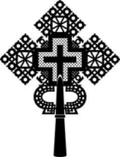

# ሕጊ ቤተ ክርስቲያን
_ኣቡነ ኣረጋዊ ኦርቶዶክስ ተዋህዶ ቤተ ክርስቲያን - ስርዓተ ምድማርን መምርሒታትን_

## 1. ርእሰ ጉባኤ (ፕረዚደንት)
1. ተግባር ርእሰ ጉባኤ እቲ ኮሚተ ብወግዓዊ ሕጊ እዚ ብዝተወሰነ መምርሒታት ምእራም እዩ።
2. ርእሰ ጉባኤ ንኹሎም ኣኼባታት ብመሰረት እዚ ሕጊ እዚ ይመርሖም።
3. ንኹሎም ኣኼባታት ኣጀንዳ ይዳሎ ከምኡውን ኣባላት ናብ ልሙድ ከምኡውን ፍሉይ ኣኼባታት ዕላ ይጽውዖም።
4. ኣብ ውዕል ምስ ካልኦት ተቋማት ንዘበና እታ ቤተ ክርስቲያን ኣብ ዝሓለፈሉ ውዕላት ወሳኒ እዚ ዕላ ካብ ሓበሻት ኣባላት ኮሚተ ፀብጻ ከምኡውን ፍቓድ ክረኽብ ኣለዎ።
5. ኣብ ስብሰባ ማእከላይ ጉባኤ ኣብ ናይ እዚ ኮሚተ ኣቀማምጣ ወይ ጸብጻታት ክገልጽ ይኽእል እዩ።
6. ከም ኵሉ ኣባል ኮሚተ እዚ ኸልኦ ሓደ ድምጺ ጥራይ ኣለዎ።
7. ኵሎም ዝተዋህበ ምክራት ከምኡውን ዝተወሰኑ ተግባራት ክትፍጸሙ ይጠብቅ።

## 2. ምክትል ርእሰ ጉባኤ (ቪስ ፕረዚደንት)
1. ኣብ ኣልቦነት ርእሰ ጉባኤ ን ተግባራቱ ይሰርሕ።
2. ከም ኵሉ ኣባል ኮሚተ ሓደ ድምጺ ጥራይ ኣለዎ።
3. ብግዜ ብግዜ ከም ዘሎዎ ዝኾነ ፍሉይ እዚ ረጋጅነት ይምደብ።

## 3. ሓበሻይ ጸሓፊ (ጄነራል ከከረተሪ)
1. ኣብ ኵሎም ኣኼባታት ኮሚተ ከምኡውን ማእከላይ ጉባኤ ጸሓፊ ኮይኑ ይሰርሕ።
2. ንዝተወሰኑ ውሳነታት ናይ ምፍጻም ምዕባለታት ክክትል ከምኡውን ጸብጻት ክገብር ይወሃቦ።
3. ኵሎም ዝምልከቱ ዜናታት ናብ ኣባላት ቤተ ክርስቲያን ከምኡውን ኣባላት ኮሚተ ብቕልጡፍ ይሰዲዶም።
4. ኣጀንዳ ኣኼባታት ይዳሎ ከምኡውን መዝገብ ኣኼባታት ኮሚተ ከምኡውን ማእከላይ ጉባኤ ይካየድ።
5. ኣብ ኣልቦነት ርእሰ ጉባኤ ከምኡውን ምክትል ርእሰ ጉባኤ ንኣኼባታት ኮሚተ ይመርሕ።

## 4. ሓለዋይ ኣካውንታንት (ቻይፍ ኣካውንታንት)
1. ብሕሱምነት: እዚ ሓለዋይ ኣካውንታንት ቀዳምነት ናይ ኣካውንቲን፡ ፋይናንስን ብሕሱም ክህልዎ ኣለዎ። እንተዘይኮነ ግን፡ እቲ ኮሚተ ካብ ኣባላት ቤተ ክርስቲያን ኣብዚ መዳይ ዝሰለጠነ ተጋዳላይ ክሕግዞ ኣለዎ።
2. እቲ ሓለዋይ ኣካውንታንት ኵሎም ንብረት ከምኡውን ዕዳታት ቤተ ክርስቲያን ብመሰረት ናይ ተቀባልነት ዘለዎም ኣካውንቲን፡ ሕጋዊ መምርሒታት ይካየድ።
3. ኣብ ክፍሊ ፋይናንስ ቤተ ክርስቲያን ግቡእ ናይ ውሽጣዊ ቁጠጣ ስርዓት ከም ዘሎ ይጠብቅ።
4. ኵሎም ፋይናንሳዊ ሰነዳት ብኣጽቦትን ብተራ ኣብ ዝተወሰነ መዕቀኒ ንዝተፈላለዩ ሰበ ስልጣን ቤተ ክርስቲያን ከምኡውን ኣውዳውላት ንምርኣይ ይካየድ።
5. ኵሎም ክፍሊታት ብግዜኡን ኣብ ዝተፈላለየ በጃት ከም ዝኽፈሉ ይረጋግጽ።
6. ኵሎም ዝምልከቱ ክፍሊታት ከም ዝበጽሑ ከምኡውን ረሲት ክህብ ይረጋግጽ።
7. ኣብ ውሽጢ ዓመት ከምኡውን ዓመታዊ ፋይናንሳዊ ጸብጻታት ንማእከላይ ጉባኤ ንምቕራብ ይዳሎ።
8. ኵሎም ዝምልከቱ ፋይናንሳዊ ሰነዳት ንኣውዳውላት ይዳሎ ከምኡውን ይህቦም።
9. ናይ ኣውዳውላት ምክራት ብዛዕባ መጻሕፍቲ ኣካውንቲን ይፍጸም።
10. ኵሎም ካራት ክፍሊት ከምኡውን ፋይናንሳዊ ውልታት ብዝተወሰኑ ምልክት ኣቕራብቲ ከም ዝፈረሙ ይረጋግጽ።
11. ወርሓዊ ምልካእ ባንክ ይዳሎ ከምኡውን ንኮሚተ ንምግላጽ ከምኡውን ንምግባር ይህቦ።
12. ምስ ርእሰ ኮሚተ ኣስተዳድርን ኣገልግሎትን ብምምኽናይ ዓመታዊ በጃት ንማእከላይ ጉባኤ ንምቕራብ ይዳሎ።
13. ናይ ቤተ ክርስቲያን ኣበው ከምኡውን ገንዘብ ይዳሎ ከምኡውን ይቆጻጸር።

## 5. ገንዘብ ሓላፊ (ትረዘረር)
1. እቲ ገንዘብ ሓላፊ ንመጻሕፍትን እዚ ሰነዳትን ቤተ ክርስቲያን ንምሕላውን ንምዕቃብን ይወሃቦ።
2. ገንዘብ ከምኡውን ካራት ኣብ ባንክ ቤተ ክርስቲያን ኣብ ውሽጢ ሰሙን ይውድኦም።
3. እቲ ብኣካውንታንት ዝተመደበ ንኣሽቱ ወጻምታት ይዳሎ።